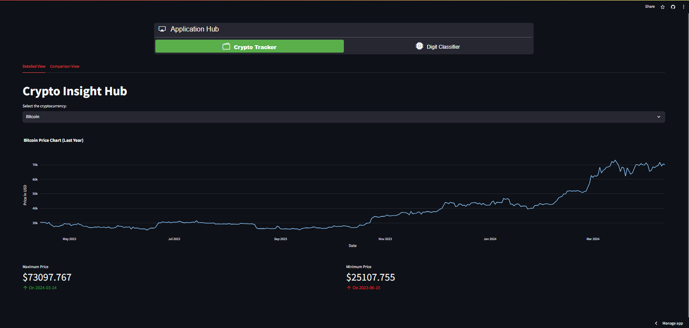
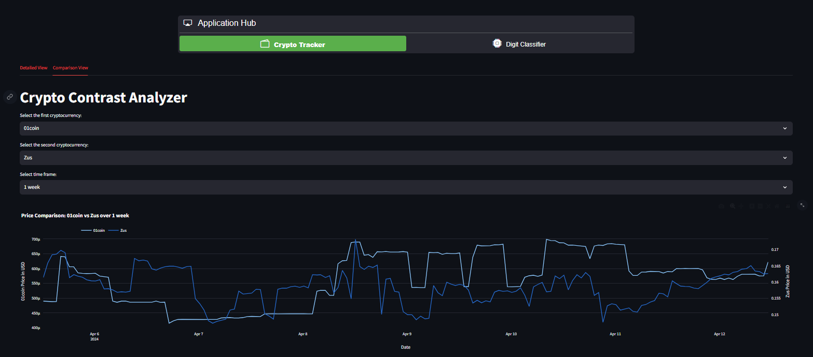

# Cryptocurrency Analysis and Image Classification Assignment

## Submitted by: A00476511

## Streamlit Cloud Deployment

Visit the following URL to interact with the deployed application:

- [A00463237 Streamlit Application](https://a00463237-pythonassignment.streamlit.app/)

This repository contains a Python assignment focused on creating interactive Streamlit applications for cryptocurrency analysis and image classification. The assignment consists of three parts:

## Part 1: Stock Details App

This Streamlit application utilizes the CoinGecko API to provide interactive analysis of cryptocurrency data. Users can input a cryptocurrency name (e.g., Bitcoin, Ethereum), and the app will display:

- A plot of the coin's price over the last year (52 weeks).
- Maximum and minimum prices during that timeframe.
- Dates when the coin traded at its highest and lowest.



## Part 2: Coin Comparison App

Expanding on the first app, this Streamlit application allows users to compare the price performance of two cryptocurrencies. Features include:

- Overlaid price performance graphs of two selected coins.
- Interactive time frame selection (1 week, 1 month, 1 year).



*Note: The API does not allow fetching data for 5 years.*

## Part 3: Image Classifier

An image classification Streamlit app that identifies digits (0-9) in uploaded images. The model demonstrates a test accuracy of 0.9919. Key features include:

- Users can upload square images of digits for classification.
- The model automatically resizes uploaded images for processing.


### Test Accuracy of the Image Classifier Model

- Test accuracy: 0.9919

## How to Use

Instructions on how to run the applications locally and interact with the deployed versions can be found in the corresponding application directories within this repository.

## Requirements

All required Python packages and dependencies are listed in the `requirements.txt` file. Install them using:

```sh
pip install -r requirements.txt
